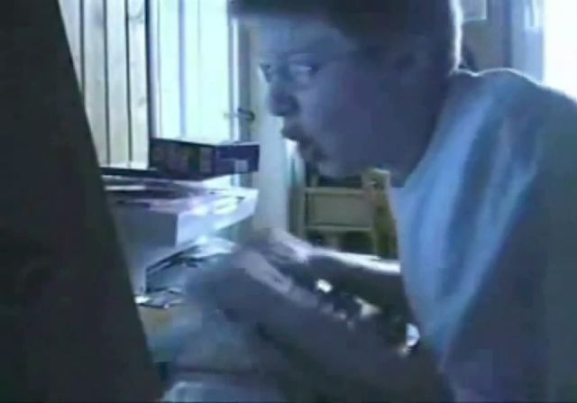

我很早就想写一篇这个文章了，我很喜欢摄影，但是不得不说一下相机技术与摄像的坏处。
<!--more-->
# 前言
众所周知，相机是人类伟大的发明，它使得你的人生经历可以被制作成实物反复品味，保存您认为珍贵的瞬间。如果真的是只是这样使用的话那便太好了。但是越来越多相机的镜头对准的不再是自己的经历，而是他人的。
# 正文
在这里，我直言不讳，相机严重的影响到了我的生活！我厌恶他。我不希望我的脸出现在任何网络空间，以及别人的相机里，这是侵犯了我个人隐私的。现在我来到一个景点，我不能再简单轻松的看风景来愉悦我的身心，我还要防止我出现在他人的摄像头中。但是防不胜防，左边是一对使用自拍杆拍照的情侣，右边是游客给自己亲人拍摄肖像，后边是一群静悄悄拍照的老法师，前面是丝毫不在意他人隐私的节拍摄影师，镜头无处不在。你需要小心谨慎，生怕哪个镜头就记录下你的糗事。想打喷嚏？不行，被拍到了就很尴尬；天上掉下一只虫子，害怕吗？请不要尖叫，因为有人在录像，这些案例中，镜头简直比警察还管用，因为你偷东西被警察抓了，警察还会因为隐私保护给你打上马赛克，可是被个人拍到了，如果那张照片您的动作或表情再相对有趣些的话，您将有可能被做成一个表情，被一个不知道是谁的人做成表情，再不知道的群体中传播。如果您有幸红了，那你将被永远粘上这个标签。而标签的效应有多么严重，可以参考一下网络上和音 MAD 的知名人物 [奥博尔特·安德里亚斯·斯里克（德国 Boy）的经历](https://zhuanlan.zhihu.com/p/36791003)。

## 所以
我希望阅读完我这篇文章的摄影爱好者，或者有摄影动机的朋友，再拍照前征得对方允许，如果是瞬时的精彩的镜头，也请问一下当事人是否愿意留下这张照片在您的拍摄设备中。这样就可以避免大多数的纠纷，让双方都感到舒适了。毕竟没人愿意留下黑历史。
# 结语
以上只代表个人想法，只是我有感而发的记录，如果您不同意我的观点，那请保留您个人的意见。