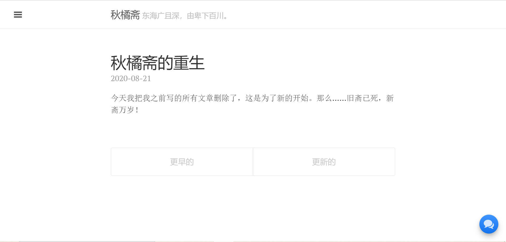

今天我把我之前写的所有文章删除了，这是为了新的开始。那么……旧斋已死，新斋万岁！
<!--more-->
# 为什么删除了文章?

今天在群里，跟 [雪千渔](http://www.imxqy.com/) 和南晨讨论起了博客这一话题，突然想到了我的博客。这个有三年历史的老东西，似乎很久没更新了。我在浏览器输入了它的域名，浏览器慢慢加载着，页面上一点点显示出了纯白的页面，我也看到了我最后一次更新——是在去年十二月，祝贺我的博客两周年。点击更早的文章，我看到了那个时候充满激情的我。那时候我有充沛的表达欲，如火的激情和稚嫩的语言。我眼睛一行行的扫过这些文字，它们或愤懑，或静谧，或尖酸，或喑哑。这些都是我留下的痕迹，而我也知道：**他们过时了**。重审这些文字，我却有一种陌生感：“这些真的是我写的吗？我怎么会写出那么偏激的观点？怎么会这般刻薄？”所以我决定抛弃掉他们，也是和过去的我道别，走向新的开始。

# 之后的秋橘斋

这里始终是我的个人空间，我在这里享受着很多自由。我希望我毋忘在莒，写我想写的，而不是可以去讨好谁。这个网站我肯定是要对他进行一番大改动，因为现在的他实在“积贫积弱”——它对我不友好，每次想要新加一个子栏目，就要直接改动源代码，实在是自找麻烦；它对读者更不友好，它不支持搜索，使得读者想要找一篇文章难如登天。它没有评论，使得读者无法同我快速交流观点。网站设计也很多不合理，有些功能藏得很深，让读者找寻起来很不方便。所以它已经“病入膏肓”，不治不行了。

而内容的话，我肯定会继续更新技术类的文章。但是这里毕竟是我的天地，我也会在里面写一些比较私密的文章——例如书评，杂文，评测，小说之类的。我也会尽量保证质量，但我毕竟不是专业的文字工作者，总难免会出些错误，希望各位读者朋友不吝赐教。若是对网站的功能有什么不满，也可以通过邮箱，或者我将要添加的评论功能来联系我。

# 后记

感谢您读完我这篇文章，祝各位读者生活顺利。再见。

# 秋菊斋的 2020 年 8 月 21 日
